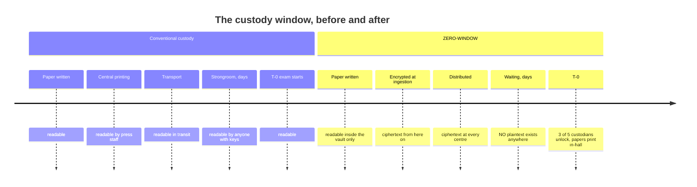
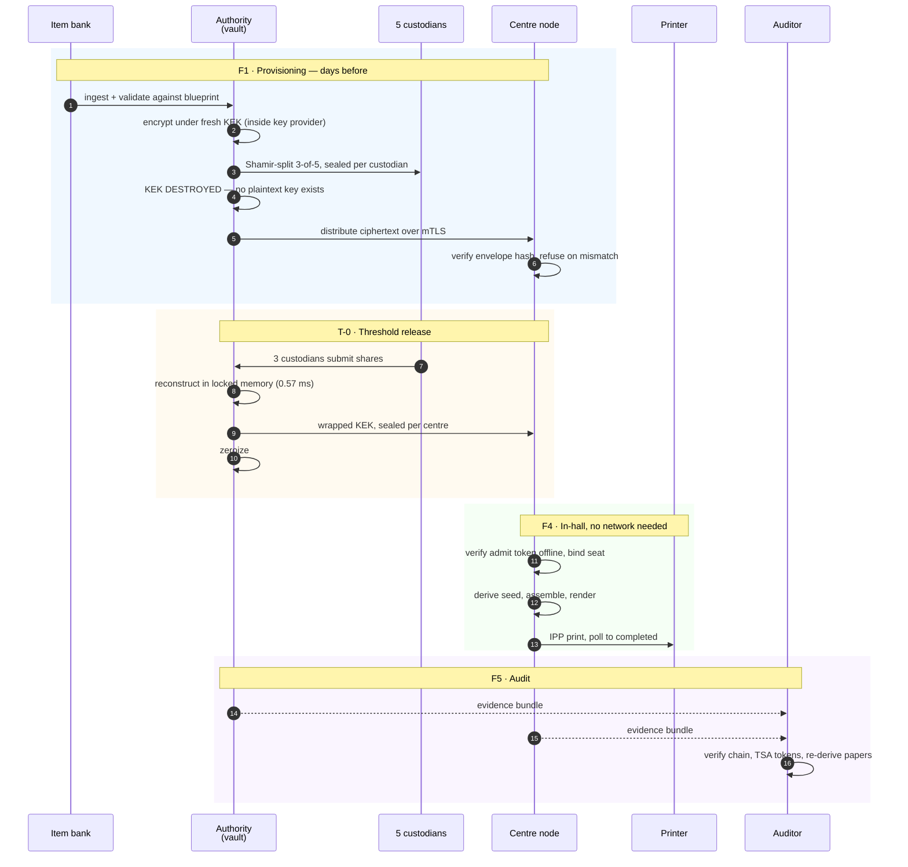
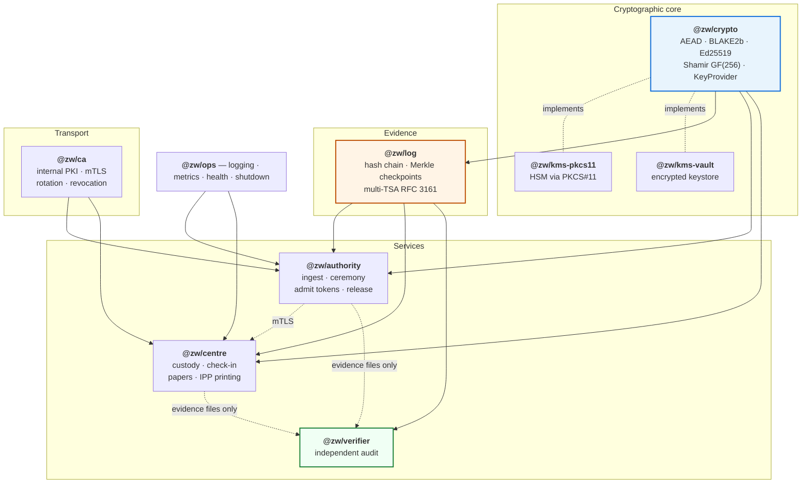
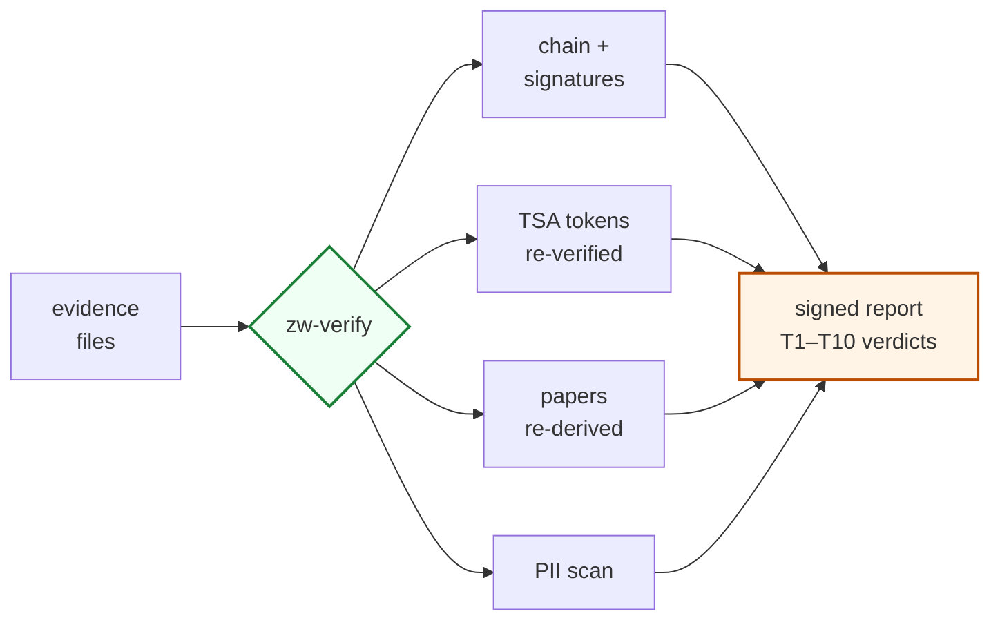

<div align="center">

# ZERO-WINDOW

### Exam papers cannot leak from a window that does not exist.

A chain-of-custody platform for high-stakes paper examinations.
Question banks live as ciphertext. Decryption needs 3 of 5 custodians.
Every candidate gets a different paper. Every custody event is anchored
to timestamping services no exam board controls.

[](https://github.com/infinitule/zero-window/actions/workflows/ci.yml)
[](LICENSE)
[](#engineering)
[](https://nodejs.org)
[](tsconfig.base.json)

</div>

---

## The window

Between the moment a paper is written and the moment candidates open it, a
readable copy exists — in a strongroom, on a press, in a courier's van, in an
official's drawer. Everyone in that chain is a person who could leak it, and
in India between 2015 and 2024 enough of them did to affect an estimated
**1.4–1.5 crore candidates** across **50+ documented leaks**, forcing 48+
re-examinations.



Twenty-four hours before T-0 — the point at which the NEET-UG 2024 paper was
sold for ₹30–32 lakh per candidate — this system has no readable paper
anywhere. Not at the authority. Not at any centre. Not in any single
custodian's hands.

> **What this does and does not fix.** It closes the custody window. It does
> not stop a question-setter leaking their own draft, or a bribed invigilator
> admitting a dummy candidate. [IMPACT.md](IMPACT.md) maps six closed vectors
> and five open ones against the documented Indian record.

---

## Every candidate gets a different paper

Two adjacent seats in the same hall, generated from the same bundle. Same
blueprint, different questions, different option order, different hashes:

<table>
<tr>
<td width="50%"></td>
<td width="50%"></td>
</tr>
<tr>
<td align="center"><b>Seat A-014</b><br/><code>Q1 = mechanics-easy-5</code></td>
<td align="center"><b>Seat A-015</b><br/><code>Q1 = mechanics-easy-0</code></td>
</tr>
</table>

Each paper carries a **QR code** binding `{exam, centre, seat, content-hash}`
and a **page-chain footer** — `Page 1 of 3 · 33a67a0b68c0 · A-014` — where the
hash chains across pages, so removing or substituting a printed page is
detectable from the paper alone.

The paper is a deterministic function of the candidate's admit token:

```
seed = BLAKE2b(exam_id ‖ centre_id ‖ token_hash)
```

Given the post-exam disclosure, an auditor **re-derives any candidate's paper
byte-for-byte** and compares it against the log. A photographed page either
matches a seat, or it is not a paper this system produced. That is the
dispute-resolution mechanism, and it is the reason the render path pins fonts,
metadata and timestamps.

---

## How custody actually flows



**The authority can be switched off after step 10 and the exam still
finishes.** That is enforced structurally: the exam-day path holds no
reference to any network client, and an integration test kills the authority
mid-exam to prove it.

---

## Architecture



The verifier depends only on the read path and the paper generator. It cannot
write evidence, and it never talks to a running service — it reads files an
auditor was handed.

---

## Quick start

```bash
pnpm install && pnpm build && pnpm test
pnpm pilot                # full acceptance rehearsal, ~30s
pnpm pilot --offline      # same, without live TSA anchoring
```

`pnpm pilot` drives three centres × 100 candidates through the complete flow
with real components: real internal CA and TLS 1.3, real 3-of-5 ceremony,
real IPP printing with a deliberate printer failure, real anchoring to FreeTSA
and DigiCert, and a full independent audit. It exits non-zero if any
acceptance criterion fails.

---

## Acceptance run

<div align="center">

| Criterion | Result |
|:---|:---|
| Papers printed | **300 / 300** |
| Distinct paper hashes | **300** |
| Plaintext KEK lifetime | **0.57 ms** · budget 500 ms |
| Early release attempt | **refused + logged** |
| Printer failover | **50 events**, exam completed |
| Plaintext at rest on centres | **0 leaks** |
| Papers re-derived byte-identically | **12** |
| TSA anchors verified | **8** · FreeTSA + DigiCert |

</div>

```
════════════════════════════════════════════════════════════════════════
ZERO-WINDOW PILOT REHEARSAL — acceptance run
3 centres × 100 candidates, 3-of-5 threshold, live TSA anchoring
════════════════════════════════════════════════════════════════════════
[   0.0s] CA initialized — offline root + online issuing intermediate, ECDSA P-384
[   0.5s] enrolled 5 custodians — threshold 3
[   2.1s] authority listening on mTLS :51770 — TLS 1.3, client certs required
[   2.2s] ciphertext bundles transferred over mTLS — each centre verified the hash
[   2.3s] early release REFUSED and logged — EARLY_RELEASE_ATTEMPT with custodian ids
[   2.3s] KEK released to 3 centres — plaintext KEK lifetime 0.57ms (budget 500ms)
[   2.3s] authority HTTP service STOPPED — centres are now fully autonomous
[   4.6s] CENTRE-B: PRIMARY PRINTER KILLED mid-run — after 50 papers
[  30.2s] CENTRE-C: anchored to freetsa.org, digicert

PILOT PASSED in 30.2s — 10/10 acceptance criteria
```

### Threat model verdicts from that run

| | Threat | Verdict | Evidence |
|:--|:--|:--|:--|
| **T1** | Authority insider exfiltrates plaintext pre-T0 | `PASS` | 2 bundles, 2 distinct KEK fingerprints, 0.57 ms lifetime |
| **T2** | Centre decrypts early | `ATTENTION` | rehearsed attempt **refused**; schedule check held |
| **T3** | Bundle tampering in transit | `PASS` | distributed/received hashes agree at 3 centres |
| **T4** | In-hall leak traceability | `PASS` | 12 papers re-derived byte-identically, all unique |
| **T5** | Fabricated early-leak evidence | `PASS` | final checkpoints anchored by freetsa.org + digicert |
| **T6** | Operator rewrites history | `PASS` | 4 logs verified against out-of-band signer list |
| **T7** | Impersonation | `PASS` | 300 papers bound token → seat → paper hash |
| **T8** | Ledger as surveillance dataset | `PASS` | no PII-shaped fields; salted hashes only |
| **T9** | Custodian collusion below threshold | `PASS` | 3 distinct enrolled custodians met threshold |
| **T10** | Denial of service at T-0 | `PASS` | 3/3 centres closed; 100 papers each |

> **Why T2 is ATTENTION, deliberately.** The pilot attempts a release before
> T-0 to exercise the control. The auditor refuses to bury that inside a PASS
> — someone with valid custodian shares tried to open the paper early, and
> that must surface. The acceptance criterion is *"the only attention row is
> the rehearsed refusal, and the auditor reported it"*, not *"the audit says
> PASS"*. See [D-41](DECISIONS.md).

---

## Verifying an exam as an auditor

The verifier needs evidence files and nothing else — no access to any service,
host, or operator.

```bash
zw-verify audit \
  --authority authority.evidence.jsonl \
  --centres centre-a.evidence.jsonl,centre-b.evidence.jsonl \
  --signers signers.json \
  --paper-content paper-content.json \
  --tsa freetsa,digicert
```



Absent inputs produce `NOT_EVALUATED`, never `PASS` — an audit that silently
passes a property it never tested launders absence of evidence into evidence
of absence. Exit codes: `0` PASS, `2` ATTENTION, `1` usage error.

---

## Documentation

| Document | Contents |
|:---|:---|
| [IMPACT.md](IMPACT.md) | India's documented paper leaks; which vectors this closes and which it does not |
| [THREATS.md](THREATS.md) | Threat model, the test enforcing each row, residual risks |
| [SECURITY.md](SECURITY.md) | Cryptographic design, key hierarchy, 26 named invariants |
| [PRIVACY.md](PRIVACY.md) | Data inventory, DPIA outline, retention |
| [INTEGRATIONS.md](INTEGRATIONS.md) | What an agency must provision: HSMs, TSAs, UIDAI |
| [DECISIONS.md](DECISIONS.md) | Every delegated design decision and why |
| [ROADMAP.md](ROADMAP.md) | v1.1, with the complications named |
| [runbooks/](runbooks/) | Key ceremony · exam day · incident response · restore |

---

## Engineering

<div align="center">

| Package | Purpose | Coverage |
|:---|:---|:---:|
| `@zw/crypto` | AEAD, hashing, signatures, Shamir GF(256) | **99.4%** |
| `@zw/log` | Transparency log, checkpoints, RFC 3161 | **93.5%** |
| `@zw/ca` | Internal PKI, mTLS | **94.9%** |
| `@zw/authority` | Ingest, ceremony, release | **95.9%** |
| `@zw/centre` | Custody, papers, printing | **95.1%** |
| `@zw/verifier` | Independent audit | **93.8%** |

</div>

**364 tests** (plus 4 skipped: 3 CUPS integration, 1 live-TSA — all opt-in and required in CI). Known-answer tests against published vectors
(draft-irtf-cfrg-xchacha-03, RFC 7693, RFC 8032). Property tests including a
chi-square check that *t−1* Shamir shares are statistically independent of the
key. Real TLS 1.3 handshakes, real IPP wire format, real CUPS in CI, real RFC
3161 tokens. Executable failure drills for printer failover, cold-spare
restore and offline release. 26 named invariants (`I-KP-1`, `I-REL-2`,
`I-GEN-3`, …) referenced from the tests enforcing them.

---

## Status

**v1.0.** All eight milestones complete; acceptance rehearsal passes 10/10
with live TSA anchoring.

**It has never run a live examination.** Nothing here has prevented a real
leak yet, and no claim in this repository should be read as saying otherwise.
The next step that matters is an adversarial audit by someone who would prefer
it to fail — see [IMPACT.md §5](IMPACT.md) for what would have to be true
before anyone can honestly say a paper leak was prevented rather than made
structurally harder.

<div align="center">
<sub>Apache-2.0 · built to be audited, not trusted</sub>
</div>
